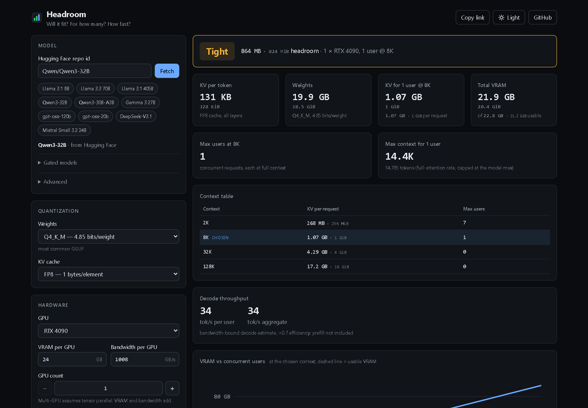

# Headroom

**Will it fit? For how many? How fast?**

Headroom is a local-LLM VRAM and KV-cache calculator. Give it a Hugging Face repo id (or pick a built-in preset), a quantization, your GPU(s), a context length and a number of concurrent users. It works out:

- weight memory at the chosen quant
- KV cache per token and per request, including sliding-window layers
- total VRAM for N concurrent users, compared with usable VRAM
- the most users that fit at your context, and the longest context that fits for your users
- a bandwidth-bound decode-speed estimate
- optionally, a cloud cost: $/hour and $ per million output tokens, given a $/GPU-hour price
- an optional speculative-decoding estimate: draft-model memory and decode speedup
- a fit matrix: a weight-quant × context-length heatmap of max users for your current model, GPUs and user count — click a cell to load it
- reverse hardware search: which bundled GPU presets and counts fit your current model, quant and workload (*Which hardware fits?*)

It runs entirely in the browser. There is no backend and no account. The whole calculator state lives in the URL, so you can share a link to it. Results can be copied as Markdown or downloaded as CSV, and the page installs as an offline-capable app — see *Export, sharing and offline* below.

The page has two tabs, **Calculator** and **Planner**. Calculator is everything above. Planner is a growing home for planning tools that hand their result to the Calculator: which model fits a task, then what hardware serves it for N users. The active tab is `?tab=planner` in the URL (Calculator is the default, so it's never written for a plain calculator link); each tab keeps its own state, so switching tabs and back loses nothing.

**Live:** https://blaine-hiers.github.io/headroom/



> **Estimates, not benchmarks.** Real runtimes (vLLM, llama.cpp, TGI, MLX…) add activation memory, allocator fragmentation, CUDA graphs and their own KV block rounding. Use Headroom to size hardware and settings, then confirm on the real stack. The *Show the math* panel shows every formula with your numbers filled in.

## Run it

```sh
npm i && npm run dev
```

| Command | What it does |
|---|---|
| `npm run dev` | dev server at `http://localhost:5173/headroom/` |
| `npm test` | Vitest: the math layer in node, the UI in jsdom |
| `npm run lint` | oxlint |
| `npm run build` | type-check and production build into `dist/` |

## Units

Every byte figure shows two numbers. The decimal one comes first (1 GB = 10⁹ B), because GPU vendors quote VRAM that way: a "24 GB" RTX 4090 has 24 × 10⁹ bytes. The binary one follows in smaller text (1 GiB = 2³⁰ B), because most LLM slides and runtime logs use binary units. That is why Llama 3 70B's KV cache per token reads **328 KB · 320 KiB**. Both are the same 327,680 bytes.

## Formulas

All sizes are in bytes.

**KV bytes per token**
- GQA/MHA: `2 × numLayers × numKvHeads × headDim × kvBytes`
  - `numKvHeads = num_key_value_heads ?? num_attention_heads`
  - `headDim = head_dim ?? hidden_size / num_attention_heads`
- MLA (DeepSeek V2/V3/R1, Kimi K2): `numLayers × (kv_lora_rank + qk_rope_head_dim) × kvBytes`. MLA stores one compressed latent per token, so there is no ×2.
- Worked check (Llama 3 70B, BF16): `2 × 80 × 8 × 128 × 2 = 327,680 B ≈ 320 KiB`

**KV bytes for one request at context C**
- Full-attention layers: `bytesPerTokenPerLayer × C`
- Sliding-window layers: `bytesPerTokenPerLayer × min(C, slidingWindow)`
- The request total is the sum across all layers. The sliding layer count comes from the first of these that the config has:
  1. a `layer_types` array: count the `"sliding_attention"` entries
  2. `sliding_window_pattern` N: `numLayers − ceil(numLayers / N)` layers slide
  3. `use_sliding_window === true`, or `sliding_window` set on a `mistral` model: every layer slides

  If none of them is present, no layers slide.
- `kvBytes`: fp16/bf16 2, fp8 1, int8 1, int4 0.5.

**Weight bytes** = `params × bitsPerWeight / 8`. The bits per weight are approximate llama.cpp effective sizes, scales included:

| quant | bits/weight |
|---|---|
| fp32 | 32 |
| bf16 / fp16 | 16 |
| fp8 | 8 |
| q8_0 / int8 | 8.5 |
| q6_k | 6.56 |
| q5_k_m | 5.69 |
| q4_k_m | 4.85 |
| q4_0 / awq / gptq (g128) | 4.5 |
| iq4_xs | 4.25 |
| nf4 (bitsandbytes) | 4.5 |
| q3_k_m | 3.91 |
| q2_k | 3.35 |

**Weight bytes from repo files.** For a GGUF repo, and for a pre-quantized safetensors repo (a `quantization_config` in `config.json`: AWQ, GPTQ, FP8…), Headroom uses the exact size of the weight files instead of the estimate:

- GGUF: the size of the chosen `.gguf` file, or of all its shards added up for a split file (`-00001-of-0000N`).
- Safetensors: the sum of the repo's top-level `*.safetensors` files (a Mistral-style duplicate `consolidated.safetensors` is left out).

The file figure only applies while the weight quant is the one the files are in. Loading the repo pre-selects that quant. bitsandbytes repos map to NF4 (`load_in_4bit`) or INT8 (`load_in_8bit`). GGUF tags not in the table (IQ2_M, Q5_K_S…) and other methods get the nearest table quant by effective bits (`fileBytes × 8 / params`). When the parameter count is unknown, the GGUF tag family decides instead (IQ2_M → Q2_K, Q4_K_XL → Q4_K_M…), and the Weights card names that closest table quant. Files that match no table quant are not used: a model note says so and the weights are estimated. Pick any other quant and the estimate comes back. An edit under **Advanced** to the parameters or the architecture also drops the file figure. The Weights card says which source it used: *from repo files* with the effective bits per weight, or *estimated*. For decode, the active share of the files is `fileBytes × activeParams / params`.

**Active params** (what decode reads per token, used by the throughput estimate). Dense models read all their params. For MoE models there are two methods, and the Weights card and the MoE note say which one was used:

- **Structural** (used when the config gives `intermediate_size` and `num_attention_heads`), summed over the layer shapes:
  - attention per layer, GQA/MHA: `hidden × (heads × headDim) + 2 × hidden × (kvHeads × headDim) + (heads × headDim) × hidden` (q, k, v, o)
  - attention per layer, MLA (when `kv_lora_rank` and `v_head_dim` exist): `hidden × q_lora_rank + q_lora_rank × heads × (qk_nope + qk_rope) + hidden × (kv_lora_rank + qk_rope) + kv_lora_rank × heads × (qk_nope + v_head_dim) + heads × v_head_dim × hidden`. Without `q_lora_rank` the q term is `hidden × heads × (qk_nope + qk_rope)`.
  - dense FFN for the first `first_k_dense_replace` layers: `3 × hidden × intermediate_size`
  - MoE FFN for the other layers: `3 × hidden × expertFfn × (expertsPerToken + sharedExperts) + hidden × numExperts` (the router), where `expertFfn = moe_intermediate_size ?? intermediate_size`
  - embeddings: `vocab × hidden`, counted once for the LM head. The input embedding is a one-row lookup per token, so it is not read in full each step. That holds whether the embeddings are tied or not.
  - `active = numLayers × attention + denseFfn + moeFfn + vocab × hidden`, capped at the total params. Biases and norms are ignored.
  - Checks against published figures: Qwen3-30B-A3B 3.04B (3.3B), Qwen3-235B-A22B 21.6B (22B), gpt-oss-20b 3.61B (3.6B), gpt-oss-120b 5.13B (5.1B), DeepSeek-V3 36.6B (37B), GLM-4.5-Air 12.8B (12B), Kimi K2 31.7B (32B).
- **Ratio** (the fallback when those fields are missing): `params × (expertsPerToken + sharedExperts) / (numExperts + sharedExperts)`. Attention and embeddings are always active, so this can understate the real figure by a third, which overstates tok/s.

**Fit**
- `effectiveVramGB = vramGB` for non-Apple GPUs; for Apple GPUs (which have unified memory), `effectiveVramGB = min(appleWiredLimitGB, vramGB ≤ 36 ? vramGB × 0.67 : vramGB × 0.75)`. macOS caps GPU-wired memory by default at 0.67× RAM for ≤36 GB, 0.75× above that (observed by MLX and llama.cpp communities). You can raise it with `sudo sysctl iogpu.wired_limit_mb=<MB>`, and Headroom will use that limit if you provide `appleWiredLimitGB` (clamped to vramGB).
- `usable = gpuCount × effectiveVramGB × 1e9 × (1 − reservePct/100)` for the `generic` runtime; other runtimes replace this (see **Runtime profiles**).
- `fixed = weights + overheadGB × 1e9 × gpuCount` (plus a runtime's own overhead allowance, if any).
- `total(N) = fixed + N × kvPerRequest(C)`
- `fits = total(N) ≤ usable`. Headroom under 10% of usable is flagged as **Tight**.
- `runs = fits`, or — with CPU/RAM offload on — the GPU/RAM split works (see **CPU/RAM offload**). `fits` always means "fits entirely in VRAM"; the verdict's headroom line, the fit-matrix colours and compare mode's "best" highlighting key off `runs`, with a matching headroom figure: `usable − total(N)` whenever the model fits in VRAM (always, with offload off), or `usable − (fixed + N × kvPerRequest(C))` once layers spill (offload's `fixed`, below).
- `maxUsers(C) = floor((usable − fixed) / kvPerRequest(C))`, or 0 if that is negative
- `maxContext(N) = min(maxPositionEmbeddings, floor((usable − fixed) / (N × bytesPerTokenFullAttention)))`. This uses the full-attention rate, so it is conservative: sliding layers only lower it. Under `vllm`, the memory-bound half of that formula is additionally rounded DOWN to a 16-token block multiple, so the reported context's actual (block-rounded) KV reservation never overshoots `usable`.

**Runtime profiles** (`src/lib/runtime.ts`, `src/lib/launchCommand.ts`). `generic` is the default and reproduces every number above exactly; the others change how usable VRAM (and, for vLLM, KV sizing) is computed, and add a *Launch command* card:

| Runtime | Usable VRAM | Extra overhead | KV sizing |
|---|---|---|---|
| `generic` | `gpuCount × effectiveVramGB × 1e9 × (1 − reservePct/100)` | — | exact context |
| `vllm` | `gpuCount × effectiveVramGB × 1e9 × gpu_memory_utilization` (default 0.9) | + 1 GB × gpuCount, a conservative labelled allowance for CUDA-graph capture and activation buffers | context rounded up to a 16-token block (vLLM's paged KV cache allocates in fixed-size blocks) |
| `sglang` | `gpuCount × effectiveVramGB × 1e9 × mem_fraction_static` (default 0.88) | — | exact context |
| `llamacpp` (covers Ollama) | same as `generic` | — | exact context; `-c` is one pool shared across `-np` parallel slots, so the launch command sets `-c` to `contextTokens × concurrentUsers` and shows/warns on the per-slot context (`c / np`) |
| `mlx` | same as `generic` (Apple unified memory already goes through `effectiveVramGB`'s wired-memory limit above — MLX does not duplicate that math) | — | exact context |

The launch command omits any flag that equals the runtime's own default (e.g. `--tensor-parallel-size` when `gpuCount` is 1, `--kv-cache-dtype`/`--cache-type-k/v` when the chosen KV quant is the runtime's native/unquantized type) and is always labelled a starting point, not a guarantee. The model id is shell-quoted (POSIX single quotes) whenever it contains anything outside `[A-Za-z0-9._/:@=+-]`. For `llamacpp`, `-hf <id>` is only used when the id looks like a GGUF repo (contains "gguf"); otherwise the command falls back to a `-m /path/to/model.gguf` placeholder with a note, since llama.cpp needs an actual GGUF file and every bundled preset is a safetensors repo. The notes also flag an unusual runtime/GPU pairing (MLX on a non-Apple GPU, or vLLM/SGLang on an Apple GPU); an unrecognized or "Custom" GPU is never flagged.

**Multi-GPU (tensor parallel)**. With more than one GPU, Headroom assumes tensor parallelism (VRAM and bandwidth add across GPUs). vLLM and most runtimes refuse to start when the head count can't be split evenly, so Headroom checks it and warns next to the fit badge:
- `numAttentionHeads % gpuCount === 0` (from the config's `num_attention_heads`, when known). If not, the nearest GPU counts that do divide evenly are suggested. Models without that field (no structural `ffn` spec) skip the check rather than warn falsely.
- `numKvHeads < gpuCount` (GQA/MHA only — see below) forces KV-head replication (some GPUs hold a duplicate KV head to keep the split even). Headroom models this: `kvReplicationFactor = gpuCount / numKvHeads` multiplies the KV total (KV per token, per request, and the context table), and a warning explains the resulting per-GPU size increase. The layout is only even when `numKvHeads % gpuCount === 0` (split) or `gpuCount % numKvHeads === 0` (replicate) — e.g. 3 KV heads over 8 GPUs satisfies neither, so that pairing is flagged too, with suggested GPU counts that satisfy both the head-count check and this one.
- **MLA models** (DeepSeek V2/V3/R1, Kimi K2) cache one compressed KV latent per token with no per-head KV projections, so KV-head replication and its split-validity check never apply to them — only the attention-head divisibility check does.

**Decode throughput** (an estimate: decode is limited by memory bandwidth)
- `bytesPerStep(N) = activeWeightBytes + N × kvPerRequest(C)`
- `stepsPerSec = bandwidthGBs × 1e9 × gpuCount × efficiency / bytesPerStep(N)`. With more than one GPU this assumes tensor parallelism, so bandwidth adds up — but real tensor-parallel communication (all-reduce between GPUs each step) is not otherwise modeled, so `efficiency` carries a small labelled scaling penalty for it: `efficiency = 0.7 × 0.9^log2(gpuCount)`, i.e. ×0.9 for each doubling of GPU count (1 at a single GPU, so single-GPU numbers are unchanged).
- per-user tok/s = `stepsPerSec`; aggregate tok/s = `stepsPerSec × N`

**Prefill / time-to-first-token** (an estimate: prefill is compute-bound, not bandwidth-bound)
- `prefillFlops ≈ 2 × activeParams × promptTokens + 2 × numLayers × promptTokens² × queryWidth`. The first term is the matmuls (same accounting as decode); the second is the O(n²) attention term (QKᵀ and attention × V).
  - `queryWidth = numAttentionHeads × headDim` when the config gives a head count (`ffn.numAttentionHeads`); otherwise `hiddenSize` stands in, since `numAttentionHeads × headDim ≈ hiddenSize` for the query projection. Which one was used is labelled next to the estimate.
- `TTFT = prefillFlops / (tflopsBf16 × 1e12 × gpuCount × MFU)`, with `MFU` (model FLOPS utilization) defaulting to **0.4**, labelled as such. `tflopsBf16` is the GPU's dense (no-sparsity) BF16 tensor rate; the estimate keeps that rate even at lower weight quants (an fp8 rate would need a separate GPU field).
- Shown for one user at the chosen context, next to the decode throughput, as a compute-bound estimate.

**Cloud cost** (optional: only shown once a $/GPU-hour price is set)
- `costPerHour = usdPerHour × gpuCount`
- `$ per 1M output tokens = costPerHour / (aggregateTokS × 3600) × 1e6`, guarded against a zero or non-finite `aggregateTokS` (shown as "—" rather than Infinity).
- `aggregateTokS` is the one effective rate the page already shows: the speculative aggregate when speculative decoding is on, otherwise the decode estimate above (the offload-aware one when offload is on).
- Shown at the chosen concurrent-user count, and again at `maxUsersAtContext` as the best case, since more concurrent users amortize the fixed weight read over more output tokens. The best case re-runs the whole calculation with `concurrentUsers = maxUsersAtContext` and reads that run's effective `aggregateTokS`, so offload and speculation apply to it exactly as they do to the current-user figure (at `N = maxUsersAtContext` the two are identical).
- The Hardware panel's **Cloud cost** field pre-fills from the GPU preset's `usdPerHour` (datacenter NVIDIA and AMD MI300X only — consumer/workstation cards, Apple and DGX Spark are bought, not rented by the hour) and is left blank for Custom. It is a typical on-demand cloud list price, **approximate and dated (prices as of 2026-09)** — not a quote. Clear it to hide the cost card.

**CPU/RAM offload** (`src/lib/offload.ts`), like llama.cpp's `-ngl`. Off by default under the Hardware panel's *Offload* disclosure — every number above is unchanged unless it's turned on. KV cache always stays on the GPU (llama.cpp's default); only weights are split.
- `bytesPerLayer ≈ weights / numLayers`, spreading the embeddings/LM head evenly across the layer count rather than placing them structurally — an approximation, like the rest of this calculator.
- `gpuLayers = clamp(floor((usable − overhead − kvForAllUsers) / bytesPerLayer), 0, numLayers)` — llama.cpp's `-ngl`. The rest, `cpuLayers = numLayers − gpuLayers`, run from system RAM.
- `cpuWeightBytes = weights − gpuLayers × bytesPerLayer` must be `≤ systemRamGB × 1e9`, **and** `usable − overhead − kvForAllUsers` must itself be `≥ 0`, or the model doesn't fit even with RAM offload — KV never leaves the GPU, so no amount of system RAM rescues a GPU that can't hold its own KV cache and overhead. The fit badge gets a fourth state, **Offloaded**, distinct from Fits/Does not fit, shown once any layers actually move to RAM and the rest fits; when it doesn't fit even with RAM, the badge falls back to Does not fit and no throughput is shown as achievable.
- Decode throughput splits into a GPU term and a RAM term, each with its own bandwidth and efficiency: `time = (gpuActiveWeightBytes + N × kvPerRequest) / (bandwidthGBs × 1e9 × gpuCount × efficiency) + cpuActiveWeightBytes / (ramBandwidthGBs × 1e9 × 0.7)`, `stepsPerSec = 1 / time`. The active weight bytes are split GPU/RAM in the same `gpuLayers / numLayers` proportion as the static weights; the GPU term reuses the exact efficiency (including the tensor-parallel penalty) from the plain decode estimate above, and the RAM term uses the same base `0.7` decode efficiency (no tensor-parallel penalty — that's GPU-to-GPU communication, not RAM).
- System RAM bandwidth has a small bundled preset list: DDR4 dual-channel ~50 GB/s, DDR5 dual-channel ~80–100 GB/s. Apple GPUs have no separate system RAM to offload to — it's unified with the GPU already — so the preset there is n/a; use the GPU's own bandwidth.
- **Capacity with offload on.** KV, overhead and draft weights must stay on the GPU; weight layers can spill to RAM, but only as far as system RAM holds them. So the fixed GPU cost is `fixed = overheadGB × 1e9 × gpuCount + draftWeights + minGpuLayers × bytesPerLayer`, where `minGpuLayers` is the fewest layers with `weights − minGpuLayers × bytesPerLayer ≤ systemRamGB × 1e9` (0 when the whole model fits in RAM). A configuration runs exactly when `fixed + N × kvPerRequest(C) ≤ usable` — the same condition as the per-N check above (GPU-side: KV + overhead fit; RAM-side: the spilled weights fit). So `maxUsers(C)` and `maxContext(N)` use the plain formulas in **Fit** with this `fixed`: they are the largest N (or C) that still runs, and one more does not. More users means fewer GPU layers and more weights in RAM, which is why the RAM size can cap them below the GPU-side limit.
- Max users, max context, the context table, the fit matrix and the VRAM-vs-users chart all read `fixedBytes` and `bytesPerUser` (`CalcResult` fields shared with the rest of the app) instead of the raw weight/KV figures: with offload off these equal `weights + overheadGB × 1e9 × gpuCount` and `kvPerRequest(C)` exactly (bit-identical to the un-split numbers); with offload on, `fixedBytes` is the offload `fixed` above, so the whole page agrees with the Offloaded badge. With offload on, the chart's line is the VRAM that must stay on the GPU; the actual `-ngl` split fills whatever is left with extra layers.
- **Launch command with offload on.** llama.cpp gets the computed `-ngl <gpuLayers>` (the verdict's figure) instead of `-ngl 999`. vLLM gets `--cpu-offload-gb <GiB>` — vLLM's flag is GiB *per GPU*, so it is `ceil(cpuWeightBytes / gpuCount / 2³⁰)` — plus a note that vLLM streams those weights over PCIe, so real speed can differ from the RAM-bandwidth estimate. SGLang gets a note that CPU offload isn't modelled for it (no flag is invented). A split that doesn't run says so in the notes.
- The offload inputs (enabled, system RAM, RAM bandwidth) are only written into the shared-link URL once they differ from the off-by-default state, so a fresh, untouched page doesn't grow a URL with meaningless `oe=0&oram=64&obw=50` keys.

**Speculative decoding** (optional, off by default — a *Speculative decoding* disclosure). A small draft model proposes `k` tokens per step; the target verifies them in one pass and keeps the accepted prefix.

- **Draft model**: a preset (its own `ModelSpec`, so its KV cache is estimated exactly the same way as the target's), a manually entered parameter count (weights only — no KV estimate, since the architecture is unknown), or "none" (n-gram / prompt-lookup drafting: no model, no memory, no per-step cost).
- **Memory**: the draft's weights at its own chosen quant, plus its KV cache at the target's context and user count, are added everywhere memory is computed — `total`/`fits`, `maxUsersAtContext`, `maxContextForUsers`, every row of the context table, and the VRAM-vs-users chart — exactly like the target's own weights and KV. `CalcResult.fixedBytes` and `.bytesPerUser` carry the combined (target + draft) figures those all read from, so they can never disagree with each other.
- **Expected tokens per verify step**: `E = (1 − α^(k+1)) / (1 − α)`, i.e. `Σ α^i` for `i = 0..k`. This is a removable 0/0 singularity at `α = 1`; the limit there is `k + 1` (every draft token accepted, plus the target's own bonus token). At `α = 0` it is `1` (the target always falls back to generating on its own).
- **Verify step time**: `targetStepSeconds + k × draftStepSeconds`, where each step time is `1 / stepsPerSec` from the same bandwidth-bound decode formula above — the draft model reuses the target's own `efficiency` (same GPUs, same tensor-parallel penalty), not a separate check for the draft's own head count. n-gram/prompt-lookup drafting has no model forward pass, so `draftStepSeconds = 0`.
- **Speculative tok/s** = `E / verifyStepSeconds` per user; the **multiplier** reported is this divided by the no-speculation `perUserTokS`. Speculative decoding helps most at **low concurrency**: as concurrent users grow, KV-cache reads dominate both the draft's and the target's step time, so the gain shrinks toward whatever the weight-only ratio between the two models allows.
- With speculation off, none of the above numbers change anything else on the page.
- The vLLM launch command doesn't configure the draft model; with speculation on it adds a note to set it up separately.

## Where the model data comes from

For a repo id, Headroom makes three requests straight from your browser. The Hub sends CORS headers, so no proxy is needed.

- `GET https://huggingface.co/api/models/{id}?expand[]=safetensors&expand[]=gated`, which gives the parameter count (`safetensors.total`)
- `GET https://huggingface.co/{id}/resolve/main/config.json`, which gives the architecture: layers, heads, head dim, MLA, sliding window, MoE and max positions
- `GET https://huggingface.co/api/models/{id}?blobs=true&expand[]=siblings&expand[]=gguf`, which lists the repo's files with their sizes, and for GGUF repos the parameter count (`gguf.total`)

**Searching for a repo id.** As you type in the repo id field, Headroom debounces ~250ms and calls `GET https://huggingface.co/api/models?search=<query>&limit=10&sort=downloads&expand[]=gated`, which also sends CORS headers. The dropdown always lists matching bundled presets first (so it works offline), then Hub results with their download count and a **gated** badge where the API reports one. A failed search (offline, rate-limited) is silent — the preset matches still work.

**Browsing by provider.** The Model panel's provider row (Meta, Qwen, Google, ...) replaces the old flat preset-chip list. Clicking a provider opens its bundled models inline — name, total params (and active params for MoE), max context, task tags, and weight size at the current quant (`src/lib/providerModels.ts`, built on the existing `weightBytes`/`catalogByProvider`) — and clicking a model loads it, exactly as a chip did. Only one provider is open at a time; click it again or press Esc to close. The loaded model is marked in its list, and its provider button shows as selected. At the bottom of an open list, **"More from &lt;provider&gt; on the Hub"** calls `GET https://huggingface.co/api/models?author=<org>&sort=downloads&limit=20` (`listAuthorModels` in `src/lib/hfSearch.ts`) for that org's top-downloaded models; the endpoint sends the same CORS headers as the search above (verified against `huggingface.co/api/models?author=Qwen`), so it works from the browser with no proxy. The section is silently hidden offline or on a failed/empty response — clicking one of its entries runs the normal Hub fetch path.

**GGUF repos** (for example `bartowski/…-GGUF`) have no `config.json`. When a repo has `.gguf` files and no `.safetensors` files, Headroom lists the GGUF files, grouping split shards, and shows a **GGUF file** picker. It defaults to Q4_K_M when there is one. The quant comes from the filename, and the file's size is the weight size. The architecture comes from the file's own header: Headroom reads the first 1 MiB with an HTTP `Range` request (`bytes=0-1048575`) on `resolve/main/{file}`. The Hub redirects that to its CDN, which answers ranged CORS reads. From the header's metadata it reads `general.architecture`, then `<arch>.block_count`, `.attention.head_count`, `.attention.head_count_kv`, `.attention.key_length`, `.context_length`, `.embedding_length`, `.feed_forward_length`, `.expert_count`, `.expert_used_count`, `.expert_shared_count`, `.expert_feed_forward_length`, `.leading_dense_block_count`, `.attention.sliding_window` and the MLA keys (`.attention.kv_lora_rank`, `.attention.q_lora_rank`, `.rope.dimension_count`, `.attention.key_length_mla`, `.attention.value_length_mla`). The vocabulary size is the length of `tokenizer.ggml.tokens`. These go through the same rules as `config.json`. GGUF files don't store which layers slide, so Headroom uses llama.cpp's fixed patterns: every 2nd layer is full attention for Gemma 2 and gpt-oss, every 4th for Cohere 2, and every 6th for Gemma 3. For other architectures no layers slide, which is the conservative choice.

If the listing or the header read fails, you get a status message and the calculator keeps its last model. A 401/403 on the header read shows the gated-repo hint. If the repo also has a usable `config.json`, Headroom uses it, as it did before GGUF support, with estimated weights and a status note. You can then enter the architecture under **Advanced**, or look up the base BF16 repo, which has the same architecture.

Gated repos such as Llama and Gemma return 401 without a token. You have two options:

- Paste a Hugging Face token under **Gated models**. With **Remember token on this device** checked, it's stored in your browser's `localStorage`; unchecked (the default), it's kept in memory only and cleared on reload. Either way it's sent only to huggingface.co.
- Use a built-in preset.

## Export, sharing and offline

- **Copy as Markdown** (`src/lib/exportMarkdown.ts`) and **download CSV** (`src/lib/exportCsv.ts`) live under the *Export* card at the bottom of the results column. Markdown includes the model, quant, hardware, workload, the headline figures (weights, KV, total VRAM, max users/context, tok/s, TTFT, and cloud cost / CPU offload / speculative decoding when they're in play), the context table, and a link back to this exact configuration — handy for pasting into a GitHub issue, Reddit or Discord. CSV covers the context table and the fit matrix, generated as a `Blob` download entirely in the browser.
- **Link previews.** `index.html` carries static Open Graph / Twitter card tags and a bundled `public/og.png` (1200×630). A static site can't render a per-state image, so every shared link previews the same generic card — that's intentional.
- **Offline / installable.** `public/manifest.webmanifest` plus a service worker (`vite.config.ts`'s `serviceWorkerPlugin`, writing `dist/sw.js` at build time) cache the built app shell, so the page reopens and works offline with presets and recently-used models once it's been loaded. Hugging Face lookups still need a network connection — the service worker explicitly never intercepts cross-origin requests. The cache is versioned from a hash of the build output, so a new deploy gets a fresh cache and the old one is dropped on activate. Navigations are network-first and never write back over the cached shell (opening `og.png` or the manifest in a tab must not become the offline `index.html`); offline, any in-scope URL falls back to the precached `index.html`. The worker's source lives in `src/sw/serviceWorkerSource.ts`, with a unit test that runs it against fake caches. The icons and `og.png` are generated by `scripts/generate-images.mjs`, a small Node script (built-ins only: `zlib` for the PNG encoding) that rasterizes the same three-bar mark as `public/favicon.svg`; re-run it after changing the brand mark.

## Adding a GPU or model preset

Presets are plain data in [`src/lib/presets/`](src/lib/presets/):

- **GPU:** add an entry to `GPU_PRESETS` in `gpus.ts` with its `name`, `vendor` (`nvidia-consumer`, `nvidia-datacenter`, `amd`, `apple` or `other`), per-GPU `vramGB` in decimal GB, `bandwidthGBs`, and `tflopsBf16` (dense, no-sparsity BF16 tensor TFLOPS from the vendor spec sheet; used for the TTFT estimate). It appears in the GPU select under its vendor group, with all three fields editable once selected. For a GPU that's actually rented by the hour (datacenter NVIDIA, AMD MI300X), also add `usdPerHour`: a typical on-demand cloud list price, dated in a comment. Leave it out for consumer/workstation cards, Apple and DGX Spark.
- **Model:** add an entry to `MODEL_CATALOG` in `catalog.ts` (see below). It appears under its provider's button in the Model panel, and in `MODEL_PRESETS`, the catalog's flat, id-keyed view.

Then run `npm test`: `presets.test.ts` checks every preset and catalog entry for sane values.

## The model catalog

`src/lib/presets/catalog.ts` is a bundled, offline catalog of Hub models grouped by provider, used to build the provider and model-for-task pickers on top of. Each entry is `{ spec: ModelSpec, meta: CatalogMeta }`:

- `spec` is a full `ModelSpec`, built with the same `preset()` helper the original flat presets used — the calculator works on it with no network call. For an ungated repo, the values come straight from `config.json` and the Hub API's `safetensors.total` (the same fields `parseConfig()` in `hf.ts` would derive from a live fetch). For a gated repo (`meta-llama/*`, `google/*`, which 401 without a Hub token), the values are the hand-verified numbers already used by the original 15 presets — see the comments on each entry for how those were sourced.
- `meta` is catalog-only metadata, kept out of `ModelSpec` so preset ids and shared-link shapes never change:
  - `provider` — one of `PROVIDERS`' ids (`meta`, `qwen`, `google`, `mistral`, `deepseek`, `openai`, `microsoft`, `moonshot`, `zhipu`, `nvidia`)
  - `family` — a human label such as `"Qwen3"` or `"R1 Distill"`
  - `tags` — one or more of the fixed `TASK_TAGS` vocabulary: `chat`, `coding`, `reasoning`, `long-context`, `vision`, `tool-use`, `multilingual`, `small-edge`. **Tags are taken from each model card's own stated capabilities and are a coarse guide, not a benchmark** — two models sharing a tag aren't necessarily equally good at it.
  - `license` — a short SPDX-ish string (`apache-2.0`, `mit`, ...) or the vendor's own community-license name when there's no SPDX id (`llama3.1`, `gemma`, `nvidia-open`, `modified-mit`)
  - `releaseDate` — `YYYY-MM`, approximate
  - `note` — optional one-line caveat (e.g. a distilled model's base-model license)

Accessors, exported from `catalog.ts` and re-exported from `src/lib/`: `MODEL_CATALOG` (all entries), `PROVIDERS` (ordered `{ id, name, hubOrg }`), `TASK_TAGS`, `catalogByProvider(providerId)`, and `findCatalogEntry(idOrName)` (mirrors `findModelPreset`, matching by id or display name). `MODEL_PRESETS`/`findModelPreset` in `models.ts` are unchanged as a name/behaviour and are now a thin, generated flat view (`MODEL_CATALOG.map(e => e.spec)`) — existing preset ids, shared links and recents keep resolving.

**Verifying the data.** `npm run check-catalog` (`scripts/check-catalog.mjs`) re-fetches every ungated entry's `config.json` and safetensors total from the Hub, runs it through the same `parseConfig()` the live fetch path uses, and diffs the result field-by-field against what's bundled — so the numbers can be re-verified whenever the repos change. Gated entries (Meta, Google) are reported as skipped rather than fetched, since they 401 without a token. It exits non-zero on drift or an unexpected fetch error. The script imports this repo's extensionless, bundler-style TS sources directly under Node's native TypeScript support via `scripts/ts-loader.mjs`, a ~20-line module resolution hook (no bundler dependency added).

**Coverage.** Meta and Google presets are the pre-existing hand-verified ones (gated, so left as-is). Nemotron's other public models are left out: `nvidia/Llama-3.1-Nemotron-70B-Instruct-HF` is gated (401), and `nvidia/Llama-3.3-Nemotron-Super-49B-v1` uses a heterogeneous per-layer ("puzzle" NAS) architecture with no single `intermediate_size`/head count for `parseConfig()` to read, so it's left out rather than guessing. OpenAI's gpt-oss ships exactly two public sizes (120b, 20b) — both are already bundled.
